# palette_constrainer
takes an input image and constrains it to a given palette of colors

# dither.py
takes an image and constrains it to a given palette 
can enable dither option which will use dithering to achieve more "colors" 
this program is super slow on large images. 

modify they values H, S, and V at the bottom to weight hue, sat, and val differently for when the program is trying to determine how similar two colors are. 
also at the bottom is where the palette is defined and the image you're operating on is defined. 
nothing is passed in from the cmd line b/c i cant be bothered. just edit the file. 

# skittle4.py
Takes an input image and "skittlefies" it.

    :param image_path: path to img to skittlefy
    :param palette: array of hex strings (available skittle colors) -- last is bg color of your canvas
    :param palette_count: count of how many of each color skittle you have. (count for last index doesnt matter)
    :param Hue_Weight: how important is preserving the hue? (hint: negative values work as a deterrent)
    :param Sat_Weight: how important is preserving the sat? (this is typically the least important weight)
    :param Val_Weight: how important is preserving the val? (this is typically the most important weight)
    :param unlimited: if true, it doesnt subtract from the count of skittles
                      (allows you to see what skittlefy would do in the ideal situation)
    :param use_all: if true, it will use every single skittle provided to it, assuming the num of skittles < canvas size
    :param priority: none, random, or confidence.
                     priority none: assigns skittles in order of the pixels
                     priority random: assigns skittles in random order
                     priority confidence: assigns the most confident skittles first
    :return: skittlefied_img, skittlefied_array, remaining_count
             skittlefied_img: cv2 img where the colors are replaced with the palette colors
             skittlefied_array: 2d array filled with the skittle colors represented by the index from palette
             remaining_count: how many of each color are remaining after skittlefying (relevant if use_all=False)

Imagine you wanted to convert an img into skittles. just input the num of skittles you have, and make sure your img is at the resolution so 1px=1skittle. 
It will try to make the best image given the skittles it has. 

# How to use
See the file main.py for an example of using this tool. The important line is where you call skittlefy. Try playing around with the settings to see the results you get. (All code below this line is for displaying the output to the user, it is not required for the function or operate correctly) 

# Examples
For all the following examples these settings remain constant: 
With ~65 bags of skittles, H_weight=1, S_weight=1, V_weight=3, canvas size=128x128   

UNLIMITED SKITTLES 
Here you can see the output skittlefy gives when given unlimmited skittles to work with, and it is allowed to throw away unwanted skittles. 
This is the ideal image it wants to produce. On the left we see the original, the middle is the output image, and the right is a rendering showing if each pixel were a skittle. 
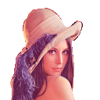  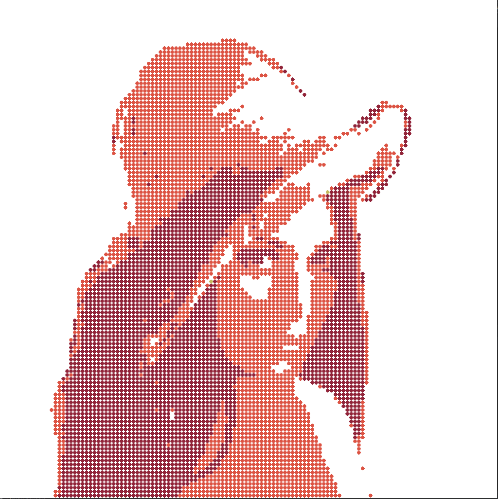   

USE ALL SKITTLES 
In these examples use_all is true, meaning the program MUST use ALL the skittles it is given. 
The left shows the skittles being assigned with no order (pixel order), the middle random order, and the right uses confidence order (skittles most confident in their color get placed first) (below shows the rendering as if each pixel were a skittle) 
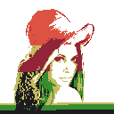 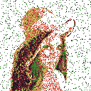 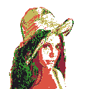 
 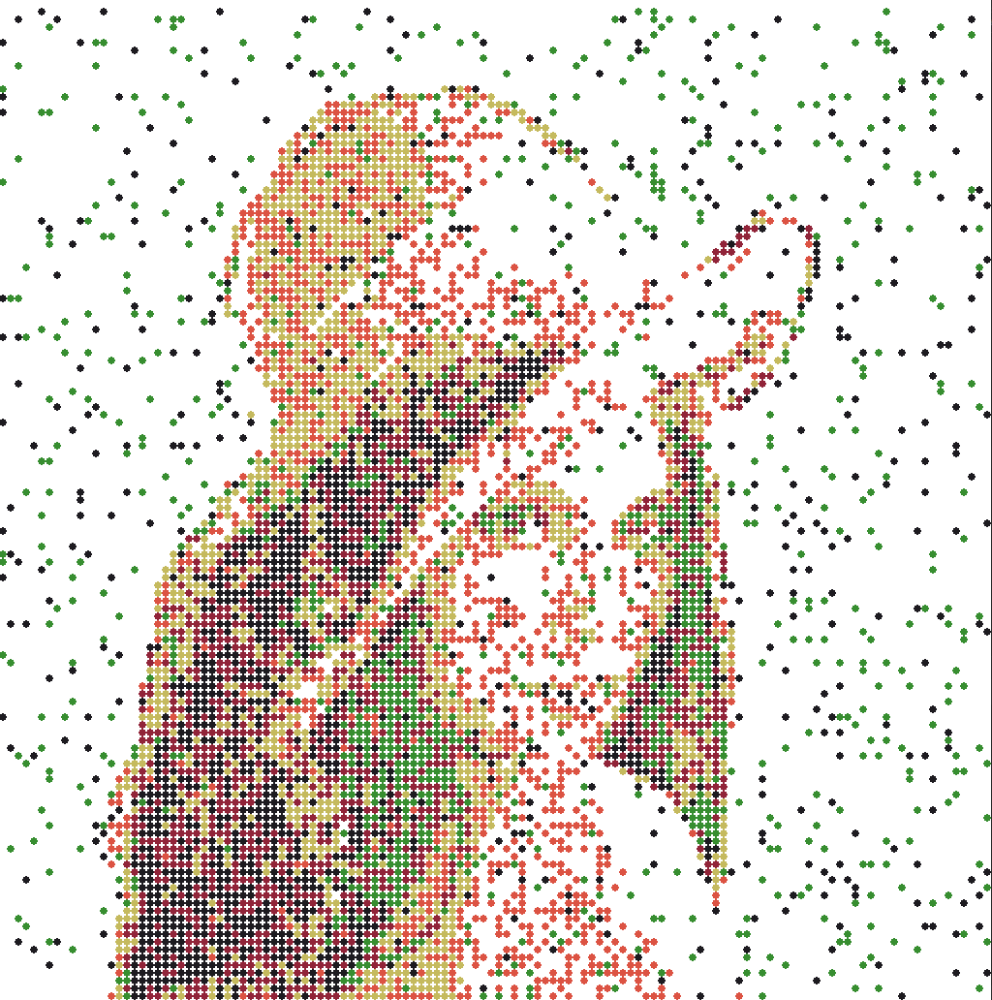 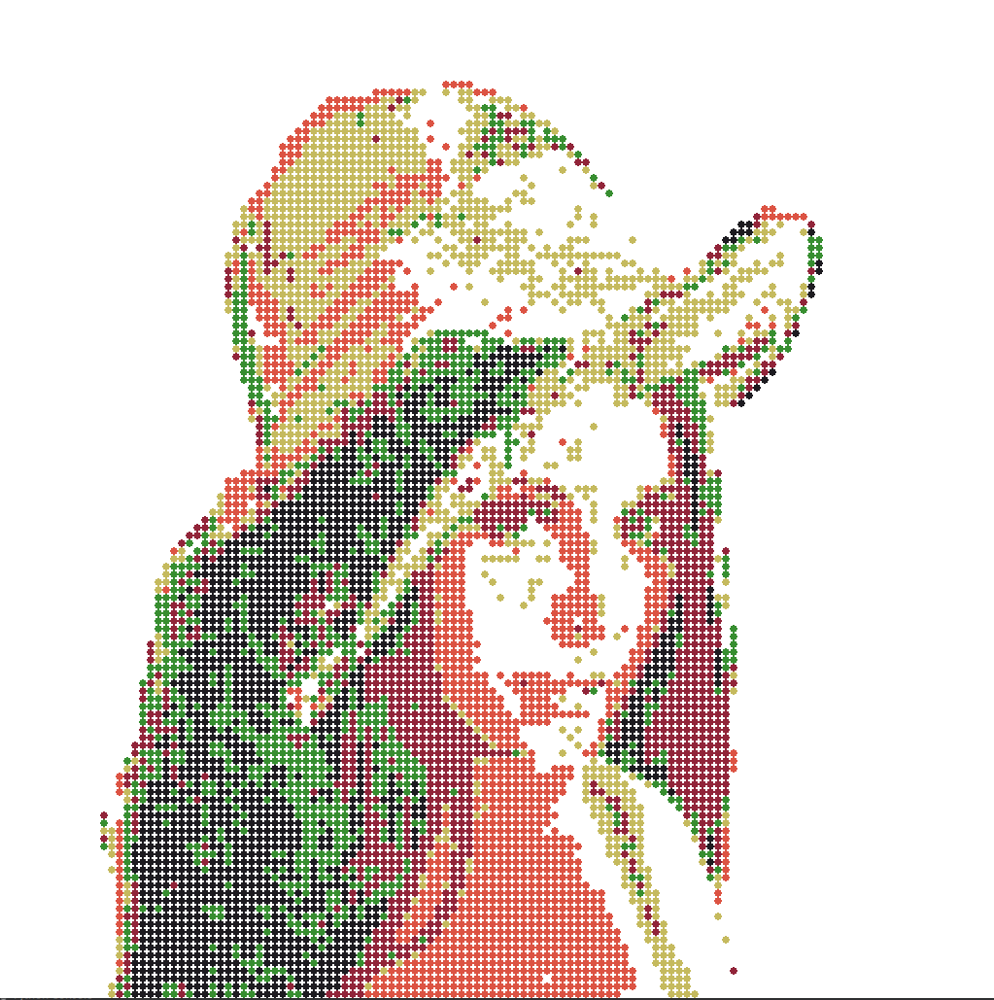   

USE SOME SKITTLES 
In these examples use_all is false, meaning the program doesn't have to use skittles if they dont fit, it can leave the space blank. 
The left shows the skittles being assigned with no order (pixel order), the middle random order, and the right uses confidence order (skittles most confident in their color get placed first) (below shows the rendering as if each pixel were a skittle) 
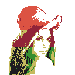  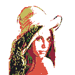 
 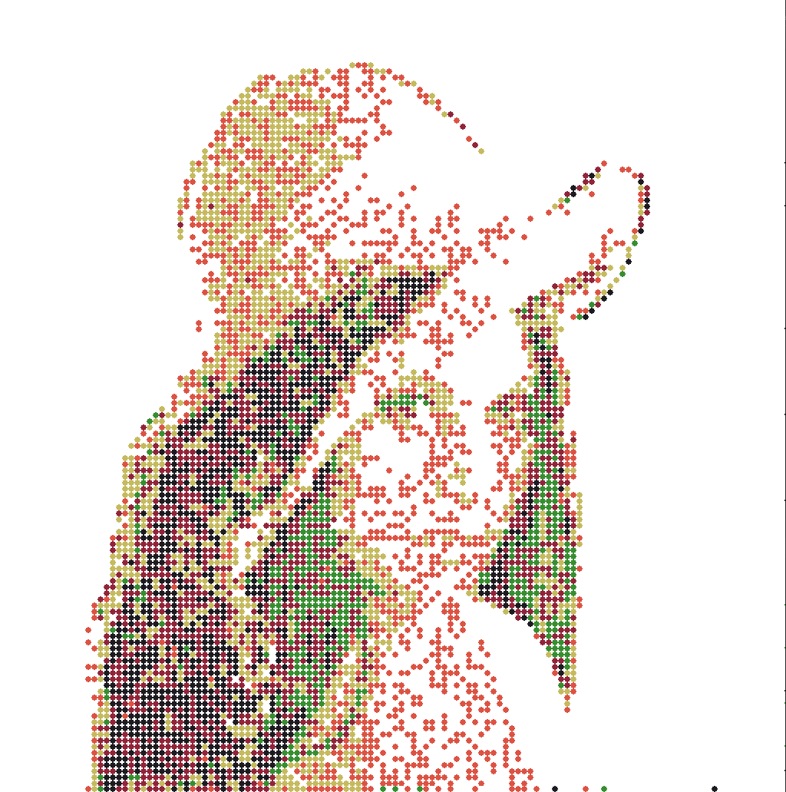 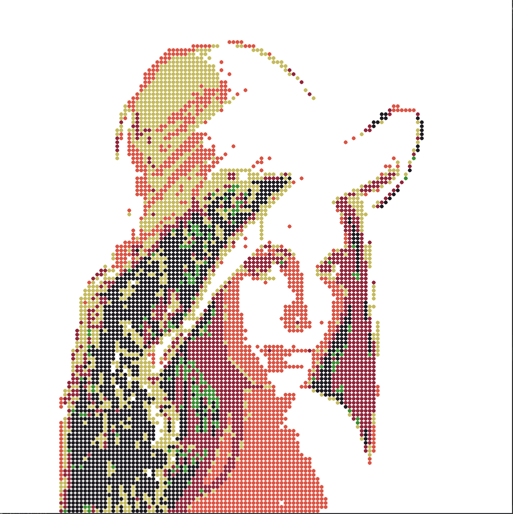   

